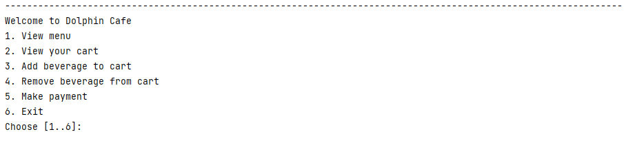
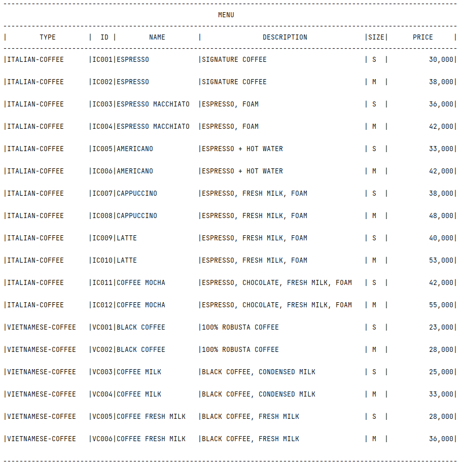

# Drink-Ordering-System
This repository consists of Java Source Code for Drink Ordering System. In this repository I have created a TUI program for Drink Ordering System which consists of 5 different operation. 
(1) View Menu   (2) View Your Cart  (3) Add beverage to cart   (4) Remove beverage from cart   (5) Make payment 

The Program is completely based on OOPs concept.

And this one is our menu ⭐⭐⭐

